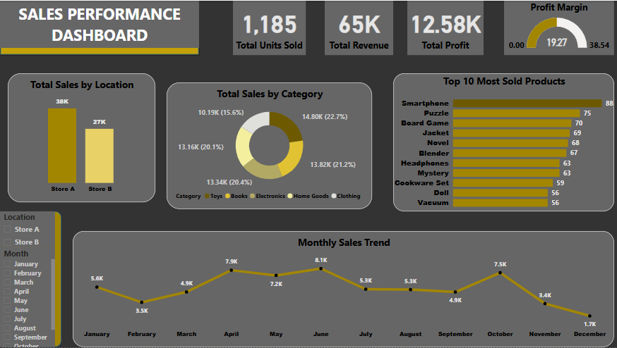
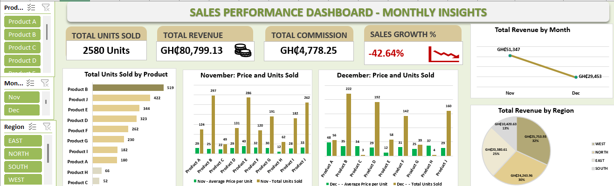

#  Belinda Ntow - Data Analyst Portfolio
  Hello! I’m Belinda Ntow, a data analyst passionate about transforming raw data into actionable insights. With expertise in SQL, Excel and Power BI, I’m excited to help businesses uncover trends and make data-driven decisions.
  
 ## Table of Contents
 1. [Personal Information](#personal-information)
 2. [About Me](#about-Me)
 3. [Skills](#Skills)
 4. [Portfolio Projects](#portfolio-projects)
    - [PowerBI](#PowerBI)
    - [Excel](#excel)
    - [SQL](#sql)
      
    
##  Personal Information  

-   **Name:** Belinda Ansabea Ntow 

- **Location:** [Accra, Ghana]  

- 🔗 **LinkedIn:** [linkedin.com/in/belinda-ansabea-54a57b236](#) 
  
- 📧 **Email:** [belindansabea@gmail.com]

##  About Me 

I’m a data analyst with a background in Economics and a strong passion for using data to drive impactful business decisions. After completing an intensive data analysis training, I've gained hands-on experience with tools like SQL, Excel, and Power BI, allowing me to dive into real-world projects. My journey has been shaped by various courses, virtual internships and personal projects where I worked with datasets to uncover trends, solve problems, and deliver actionable insights. Excited to apply my skills in dynamic teams, I’m ready to help businesses unlock the full potential of their data.

##  Skills
- Languages: Python, SQL 
-	Libraries: Pandas, Matplotlib, Seaborn 
-	Data Visualization: Power BI, Advanced Excel (Charts, Pivot tables) 
-	Data Handling: Data Entry & Processing, Data Cleaning, Data Wrangling 
-	Reporting & Documentation: Advanced Excel, MS Word, PowerPoint 
-	Techniques: Statistical Analysis, Exploratory Data Analysis (EDA) 

## Portfolio Projects  

This section highlights some of my data analysis projects, showcasing my skills with various tools to analyse data, derive insights and solve real-world problems.

### ►**PowerBI**

In these projects, I used Power BI for data transformation, modeling, and visualization to create interactive dashboards and reports.
  
#### 1. Retail Sales Analysis
Analyzed retail sales data to uncover key trends in product performance, regional sales, and seasonal patterns. The dashboard below visualizes these insights, providing a clear view of the data trends.

[Explore Project File](Projects_Files/Retail%20Sales%20Analysis.pbix)

#### 2. Tourism Analysis
Analyzed tourism data to identify trends in visitor inflows, revenue generation and seasonal patterns.The interactive dashboard below visualizes key insights, providing a clear representation of these findings

[Explore Project File](Projects_Files/Tourism%20Analysis.pbix)

#### 3. Call Centre Analysis – Efficiency and Satisfaction
Analyzed 5,000 rows of call centre data by cleaning in Excel and visualizing in Power BI to assess agent efficiency, call resolution rates, and customer satisfaction trends.

---

### ►**Excel**
These projects showcase how I used Excel for data cleaning, analysis, and visualization.

#### 1. Product Sales Analysis  
 Analyzed product sales data to track units sold and revenue by region, identify monthly sales trends, and compare pricing and sales volume between November and December to understand the decline in sales. The interactive dashboard below visualizes these insights, providing a clear view of the data trends.

[Explore Project File](Projects_Files/Product%20Sales%20Analysis.xlsx)

 #### 2.Employee Performance Analysis
Analyzed employee performance data to visualize employee distribution by performance category, highlight the top 5 roles by average rating, and assess the impact of training costs on performance ratings. The dashboard provides clear insights to support informed HR decisions.

[Explore Project File](Projects_Files/Employee%20Performance%20%20Analytics.xlsx)

---

### ►**SQL**
In these projects, I used SQL for querying, manipulating, and analyzing datasets to derive insights.
  
#### 1.  Customer Loan Database Analysis
Created and analyzed a customer loan database to assess loan performance, customer repayment behavior, and outstanding balances using SQL queries.

[Explore Code](Projects_Files/Customer%20Loan%20Database.sql)

#### 2. Sales Analysis
Used SQL to clean and analyze sales data, uncover trends, and evaluate performance across different segments.

[Explore Code](Projects_Files/Salesr%20Analysis.sql)

 
