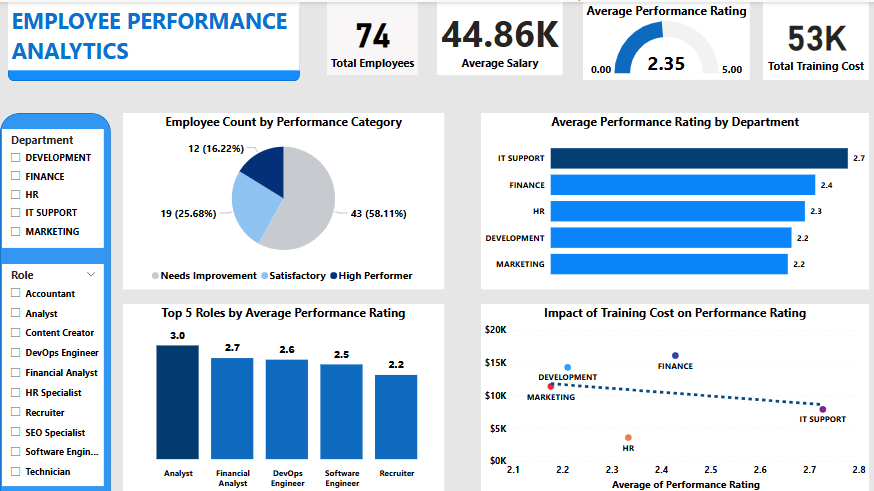

#  Belinda Ntow - Data Analyst Portfolio
  Hello! I’m Belinda Ntow, a data analyst passionate about transforming raw data into actionable insights. With expertise in SQL, Excel and Power BI, I’m excited to help businesses uncover trends and make data-driven decisions.
  
 ## Table of Contents
 1. [Personal Information](#personal-information)
 2. [About Me](#about-Me)
 3. [Skills](#Skills)
 4. [Portfolio Projects](#portfolio-projects)
    - [PowerBI](#PowerBI)
    - [Excel](#excel)
    - [SQL](#sql)
      
    
##  Personal Information  

-   **Name:** Belinda Ansabea Ntow 

- **Location:** [Accra, Ghana]  

- 🔗 **LinkedIn:** [linkedin.com/in/belinda-ansabea-54a57b236](#) 
  
- 📧 **Email:** [belindansabea@gmail.com]

##  About Me 

I’m a data analyst with a background in Economics and a strong passion for using data to drive impactful business decisions. After completing an intensive data analysis training, I've gained hands-on experience with tools like SQL, Excel, and Power BI, allowing me to dive into real-world projects. My journey has been shaped by various courses, virtual simulations and personal projects where I worked with datasets to uncover trends, solve problems, and deliver actionable insights. Excited to apply my skills in dynamic teams, I’m ready to help businesses unlock the full potential of their data.

##  Skills
- **Languages:** Python, SQL 
-	**Libraries:** Pandas, NumPy, Matplotlib, Seaborn 
-	**Data Visualization:** Power BI, Advanced Excel  
-	**Data Handling:** Data Entry & Processing, Data Cleaning, Data Wrangling 
-	**Reporting & Documentation:** Advanced Excel, MS Word, PowerPoint 
-	**Techniques:** Statistical Analysis, Exploratory Data Analysis (EDA) 

## Portfolio Projects  

This section highlights some of my data analysis projects, showcasing my skills with various tools to analyse data, derive insights and solve real-world problems.

### ►**PowerBI**

In these projects, I used Power BI for data transformation, modeling, and visualization to create interactive dashboards and reports.
  
#### 1. Retail Sales Analysis  
Analyzed monthly sales data from two retail stores to assess performance across time and locations.  

**Objective**: The goal was to evaluate how sales performed throughout the year and between Store A and Store B, to uncover trends that could guide inventory planning and marketing strategies.  

**Key Insight**: Store A generated higher overall sales ($38,000 vs. $27,000) and consistently outperformed in key categories like Electronics and Clothing, while sales peaked in June and dropped sharply in December — highlighting both location-based performance gaps and seasonal demand trends.  

[View Project on GitHub](https://github.com/Bel-Ntow/Power_BI_Projects/tree/main/Retail_Sales_Analysis)

#### 2. NovaPay Transaction Analysis
Analyzed transaction data for a Ghana-based fintech company (pseudonym: NovaPay) to uncover trends in service usage, customer behavior, and system performance.

**Objective:**  To identify key performance issues and usage patterns that can support growth and improve transaction reliability.

**Key Insight:** NovaPay achieved a 92% transaction success rate, but most failures occurred in Loan Repayments and Bill Payments. Additionally, Accra, despite being the capital, had the lowest customer activity, highlighting untapped engagement potential that could be addressed through targeted marketing or outreach efforts.

[View Project on GitHub](https://github.com/Bel-Ntow/Power_BI_Projects/tree/main/NovaPay_Transaction_Insights)

#### 3. Call Centre Analysis 
Analyzed 5,000 call centre records from January to March to uncover trends in service delivery and agent performance.

**Objective:** The goal of the project was to identify trends in service delivery and agent performance to improve efficiency and customer experience.

**Key Insight:** 27% of calls were unresolved and the average customer satisfaction rating was just 2.76, indicating a need to improve resolution processes and provide additional agent training to enhance both efficiency and customer experience

[View Project on GitHub](https://github.com/Bel-Ntow/Power_BI_Projects/tree/main/Call_Centre_Analysis)

---

### ►**Excel**
These projects showcase how I used Excel for data cleaning, analysis, and visualization.

#### 1. Product Sales Analysis  
Analyzed product sales data from November and December to uncover trends in revenue, sales volume, product performance, and regional and salesperson contributions.  

**Objective**: The goal was to understand the factors behind sales fluctuations across the two months, particularly the decline in December and identify which products, regions, and individuals most influenced overall performance.  

**Key Insight**: A total of 2,580 units were sold, generating GHS 80,421 in revenue, but sales dropped by 48.6% in December due to fewer sales weeks and no contribution from the South region.

[View Project on GitHub](https://github.com/Bel-Ntow/Excel-Projects/tree/main/Sales_Performance_Analysis)

#### 2.Digital Advertising Campaign Analysis
Analyzed the performance of digital advertising campaigns for **CreativePulse Media**, a digital media agency. 

**Objective :**  The  goal of the project was to uncover trends in client retention, evaluate campaign performance, and ROI to help improve future campaigns and client satisfaction.
  
**Key Insight :** 34% of clients were inactive and client contract status was closely linked to industry, with some sectors showing full retention and others full inactivity. Despite a strong correlation between ad spend and performance (r = 0.87), high campaign performance did not ensure retention, highlighting the need for clearer ROI communication and industry-specific retention strategies.

[View Project on GitHub](https://github.com/Bel-Ntow/Excel-Projects/tree/main/Digital_Advertising_Performance_Analysis)

 #### 3.Employee Performance Analysis
Analyzed employee performance data to visualize employee distribution by performance category, highlight the top 5 roles by average rating, and assess the impact of training costs on performance ratings. The dashboard provides clear insights to support informed HR decisions.

[Explore Project File](Projects_Files/Employee%20Performance%20%20Analytics.xlsx)

---

### ►**SQL**
In these projects, I used SQL for querying, manipulating, and analyzing datasets to derive insights.
  
#### 1.  Customer Loan Database Analysis
Created and analyzed a customer loan database to assess loan performance, customer repayment behavior, and outstanding balances using SQL queries.

[Explore Code](Projects_Files/Customer%20Loan%20Database.sql)

#### 2. Sales Analysis
Used SQL to clean and analyze sales data, uncover trends, and evaluate performance across different segments.

[Explore Code](Projects_Files/Salesr%20Analysis.sql)

 
